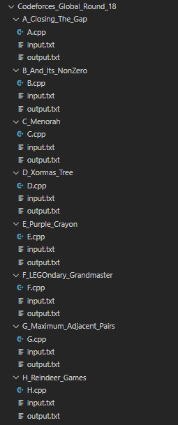

## `Codeforces Bot` is a `Node` script that creates folder structure for a codeforces contest. It will create a folder for each problem inside the contest folder. For each problem it will generate a solution files with a template, input file and output file.



# Usage
- ##### Go to your coding directory
````
    cd ./codeforces
````

- ##### Clone codeforces-bot
````
    git clone https://github.com/pr7prashant/codeforces-bot.git
````

- ##### Install Dependencies
````
    cd ./codeforces-bot

    yarn install
````

- ##### Run script with Contest ID
````
    // Generating folder structure for Contest 1615
    node script.js "1615"
````

### Note:
##### You can get the contest ID from the Problem URL.
##### For example: `https://codeforces.com/contest/1615/problem/A`
##### The Contest directory will be generated in your coding directory, `codeforces` directory in this example.
